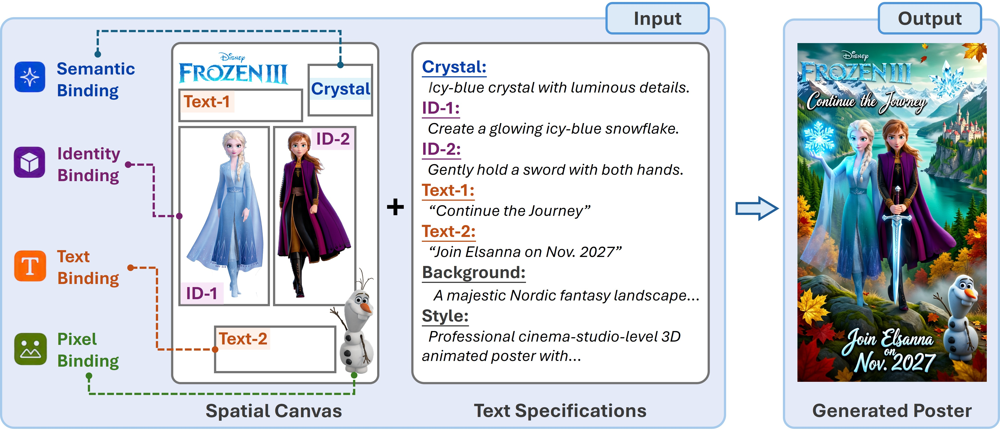

<div align="center">

<h1 align="center">
  From Prompting to <span style="color:#f2b36d;"><i>Compo</i></span>sing:<br>A Spatial Canvas Interface for Poster Generation
</h1>

<h3 align="center">
  arXiv 2026
</h3>

<p align="center" style="font-size: 1.1em; color: #555;">
  Introducing <strong>Compo</strong>, a poster generation model adapted from a pretrained image editing model without task-specific architecture design to interpret <i>Spatial Canvas Interface</i> and their associated <i>Text Specifications</i>.
</p>

<div align="center">
  <a href="#">Yitong Wang</a><sup>1,2*</sup>&nbsp;&nbsp;
  <a href="https://www.microsoft.com/en-us/research/people/fawe/">Fangyun Wei</a><sup>2*</sup>&nbsp;&nbsp;
  <a href="#">Jinjing Zhao</a><sup>3,2</sup>&nbsp;&nbsp;
  <a href="#">Sirui Zhang</a><sup>4,2</sup><br>
  <a href="https://hongyanz.github.io/">Hongyang Zhang</a><sup>5</sup>&nbsp;&nbsp;
  <a href="https://www.microsoft.com/en-us/research/people/doch/">Dong Chen</a><sup>2</sup>&nbsp;&nbsp;
  <a href="https://datascience.hku.hk/people/bo-dai/">Bo Dai</a><sup>6</sup><sup>&dagger;</sup>&nbsp;&nbsp;
  <a href="https://www.microsoft.com/en-us/research/people/yanlu/">Yan Lu</a><sup>2</sup>
</div>

<p align="center" style="font-size: 0.9em; color: #666;">
  <br>
  <sup>1</sup><a href="https://www.fudan.edu.cn/en/">Fudan University</a>&nbsp;&nbsp;
  <sup>2</sup><a href="https://www.microsoft.com/en-us/research/">Microsoft Research</a>&nbsp;&nbsp;
  <sup>3</sup><a href="https://www.sydney.edu.au/">The University of Sydney</a><br>
  <sup>4</sup><a href="https://en.ustc.edu.cn/">USTC</a>&nbsp;&nbsp;
  <sup>5</sup><a href="https://uwaterloo.ca/">University of Waterloo</a>&nbsp;&nbsp;
  <sup>6</sup><a href="https://www.hku.hk/">The University of Hong Kong</a>
  <br>
  <small><sup>*</sup>Equal Contribution</small>
  <small><sup>&dagger;</sup>Corresponding Author</small>
</p>

<p align="center">
  <a href="#"></a>
  <a href="https://snowflakewang.github.io/Compo-Page/"></a>
  <a href="https://github.com/snowflakewang/Compo"></a>
  <!-- <a href="https://huggingface.co/SnowflakeWang/Compo"></a> -->
</p>

</div>

---

## 📖 Abstract

<div align="center">
  
</div>

Text prompting is an indirect interface for poster generation, requiring users to encode inherently two-dimensional composition intent into a one-dimensional sequence of words.
We introduce a <strong>Spatial Canvas Interface</strong> that enables users to directly compose generation intent in space through four complementary binding types: semantic, identity, text, and pixel, together with Text Specifications for individual elements and global appearance.
Based on this interface, we develop <strong>Compo</strong>, a poster generation model adapted from a pretrained image editing model to understand Spatial Canvas inputs and Text Specifications.
Compo supports both direct inference, where users explicitly construct the canvas, and agentic mode, where a high-level request is automatically translated into a planned Spatial Canvas.
To train Compo, we develop a scalable pipeline that automatically constructs supervision data for different binding types and their combinations, enabling efficient adaptation without training a specialized poster generator from scratch.
We further introduce a benchmark that evaluates adherence to individual binding types and their joint composition.
Experiments show that Compo achieves stronger compositional controllability than both general-purpose image generation models and dedicated poster generation systems while maintaining high visual quality.
By decoupling intent specification from visual generation, our work shifts poster generation from <em>prompting</em> toward <em>composing</em>.

## 🔮 Citation

```bibtex
TBD
```

## 💐 Acknowledgements

- [LongCat-Image-Edit](https://huggingface.co/meituan-longcat/LongCat-Image-Edit)
- [Qwen-Image-Edit-2511](https://huggingface.co/Qwen/Qwen-Image-Edit-2511)
- [Qwen-Image-2512](https://huggingface.co/Qwen/Qwen-Image-2512)
- [Z-Image](https://huggingface.co/Tongyi-MAI/Z-Image)
- [ERNIE-Image](https://huggingface.co/baidu/ERNIE-Image)
- [FLUX.2-klein-9B](https://huggingface.co/black-forest-labs/FLUX.2-klein-9B)
- [SAM-3](https://huggingface.co/facebook/sam3)
- [Chandra-OCR-2](https://huggingface.co/datalab-to/chandra-ocr-2)
- [Diffusers](https://github.com/huggingface/diffusers)
- [Transformers](https://github.com/huggingface/transformers)
- [DeepSpeed](https://github.com/deepspeedai/DeepSpeed)

## 📄 License

This project is licensed under the [CC BY-SA 4.0 License](http://creativecommons.org/licenses/by-sa/4.0/).